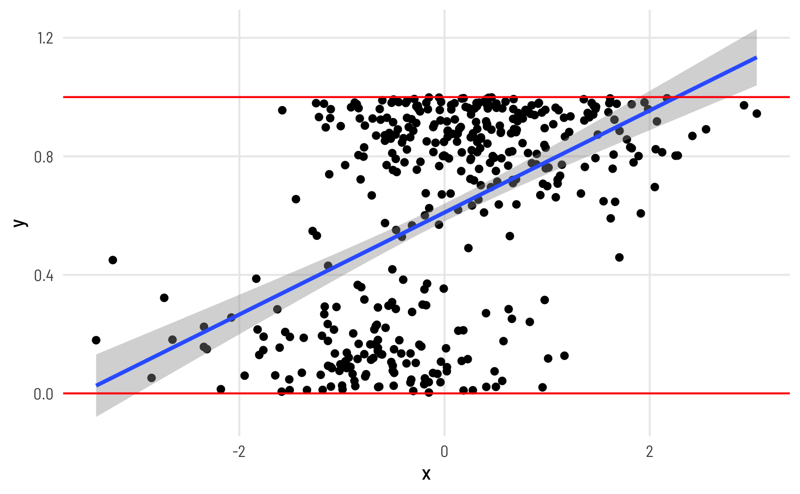

# Bayesian beta and zero-inflated beta regression models {#beta-regression}

```{r, echo = FALSE}
library(tidyverse)
library(tidybayes)
library(bayesplot)
library(rstan)
library(loo)

rstan_options(auto_write = TRUE)
options(mc.cores = parallel::detectCores())
theme_set(bayesplot::theme_default())
```


响应变量是百分比或者是介于0和1之间的数，这种情形可以用beta回归模型。
```{r echo=FALSE, out.width = '100%'}

```


比如下面的案例，

> 有议会性别配额的国家（即要求政党有最低比例的女议员的法律和法规）在各自的议会中是否有更多的女议员？

我们关注的问题是，性别配额(quotas)对议会女性席位比例的影响。


## 探索数据
```{r}
vdem_clean <- read_rds(here::here("rawdata", "vdemclean.rds"))
glimpse(vdem_clean)
```

我们选取主要的三个变量

- prop_fem  : 议会中女性比例
- quota     : 法律是否规定有性别配额
- polyarchy : 民主选举的程度和得分

```{r}
vdem_clean %>%
  select(country_name, year, prop_fem, quota, polyarchy) %>% 
  head()
```


作者做了一点小小的处理

```{r}
vdem_2015 <- vdem_clean %>% 
  filter(year == 2015) %>% 
  # Sweden and Denmark are tied for the highest polyarchy score (91.5), and R's
  # max() doesn't deal with ties, so we cheat a little and add a tiny random
  # amount of noise to each polyarchy score, mark the min and max of that
  # perturbed score, and then remove that temporary column
  mutate(polyarchy_noise = polyarchy + rnorm(n(), 0, sd = 0.01)) %>% 
  mutate(highlight = polyarchy_noise == max(polyarchy_noise) | 
           polyarchy_noise == min(polyarchy_noise)) %>% 
  select(-polyarchy_noise)
```


```{r}
vdem_2015 %>% 
  ggplot(aes(x = polyarchy, y = prop_fem)) +
  geom_point(aes(color = highlight), size = 1) +
  geom_smooth(method = "lm") +
  ggrepel::geom_label_repel(data = filter(vdem_2015, highlight == TRUE), 
                   aes(label = country_name),
                   seed = 1234) +
  scale_color_manual(values = c("grey30", "#FF4136"), guide = "none") +
  labs(x = "Polyarchy (democracy)", y = "Proportion of women in parliament") 
```


```{r}
vdem_2015 %>% 
  ggplot(aes(x = prop_fem, fill = quota)) +
  geom_density(alpha = 0.6) +
  scale_fill_viridis_d(option = "plasma", end = 0.8) +
  labs(x = "Proportion of women in parliament", y = "Density", fill = "Quota") +
  theme(legend.position = "bottom")
```


## Beta regression

beta分布有两个参数，shape1 and shape2，我们这里表示为 `a` and `b`.

```{r}
ggplot() +
  geom_function(fun = dbeta, args = list(shape1 = 6, shape2 = 4),
                aes(color = "Beta(shape1 = 6, shape2 = 4)"),
                size = 1) +
  scale_color_viridis_d(option = "plasma", name = "") +
  theme(legend.position = "bottom")
```


这个shape参数不太好理解，因此我们用类似正态分布**均值和标准差**参数一样，使用均值$\mu$和$\phi$作为beta分布的参数。转换如下

$$
\begin{aligned}
\text{shape1 } (a) &= \mu \times \phi \\
\text{shape2 } (b) &= (1 - \mu) \times \phi
\end{aligned}
$$

 
beta回归中响应变量不会出现0， 因此让数据中y = 0的点，加一点点的偏移
```{r}
vdem_2015_fake0 <- vdem_2015 %>% 
  mutate(prop_fem = ifelse(prop_fem == 0, 0.001, prop_fem))
```


```{r}
vdem_2015_fake0 %>%
  ggplot(aes(x = prop_fem, fill = quota)) +
  geom_density(alpha = 0.6) +
  scale_fill_viridis_d(option = "plasma", end = 0.8) +
  labs(x = "Proportion of women in parliament", y = "Density", fill = "Quota") +
  theme(legend.position = "bottom")
```


### stan 1

数学公式

$$
\begin{align}
y &\sim \text{Beta}(a, \, b) \quad \textrm{where}\quad a = \mu \times \phi; \quad b = (1 - \mu) \times \phi \\
\mu_i &= \text{inv_logit}(\alpha + \beta \times x_i) \quad \textrm{i.e.,} \quad \text{logit}(\mu_i) = \alpha + \beta \times x_i, \quad\text{link function} = \text{logit}\\
\phi_i &= \text{exp}(\alpha_s + \beta_s \times x_i)\quad \textrm{i.e.,} \quad \text{log}(\phi_i) = \alpha_s + \beta_s \times x_i, \quad\text{link function} = \text{log}\\
\alpha  &\sim\\
\beta  &\sim\\
\alpha_s &\sim\\
\beta_s &\sim
\end{align}
$$


```{r, warning=FALSE, message=FALSE}
stan_program <- '
data {
  int<lower=0> N;                            
  vector[N] x;                     
  vector[N] y;                          
}

parameters {
  real alpha;  
  real beta;  
  real alpha_phi;  
  real beta_phi;       
}
model {
  vector[N] mu  = alpha + beta * x;
  vector[N] phi = alpha_phi + beta_phi * x;
  
  for (n in 1:N) {
    mu[n] = inv_logit(mu[n]);
    phi[n] = exp(phi[n]);
  }
  
  for (n in 1:N) {
    target += beta_lpdf(y[n] | mu[n] * phi[n], (1 - mu[n]) * phi[n]);
  }
  
  target += student_t_lpdf(alpha | 3, 0, 2.5);
  target += student_t_lpdf(alpha_phi | 3, 0, 2.5);

}

'


stan_data <- vdem_2015_fake0 %>% 
  select(prop_fem, quota) %>% 
  tidybayes::compose_data(
    N        = nrow(.), 
    x        = as.numeric(quota), 
    y        = prop_fem
  )

stan_beta1 <- stan(model_code = stan_program, data = stan_data)
```


```{r}
stan_beta1
```


```{r}
stan_beta1 %>% 
  gather_draws(alpha, beta, alpha_phi, beta_phi) %>% 

  ggplot(aes(x = .value, y = fct_rev(.variable), fill = .variable)) +
  geom_vline(xintercept = 0) +
  stat_halfeye(.width = c(0.8, 0.95), point_interval = "median_hdi") +
  scale_fill_viridis_d(option = "viridis", end = 0.6) +
  scale_slab_alpha_discrete(range = c(1, 0.4)) +
  guides(fill = "none", slab_alpha = "none") +
  labs(x = "Coefficient", y = "Variable",
       caption = "80% and 95% credible intervals shown in black") 
```


### stan 2: 分组的方法

这里的数据只有两组：把 `x_i` 看作 **组1** 和 **组2**

```{r, warning=FALSE, message=FALSE}
stan_program <- '
data {
  int<lower=0> N;  
  int<lower=2> n_groups; 
  int<lower=1, upper=n_groups> group_id[N];                   
  vector[N] y;                          
}

parameters {
  vector[2] alpha;  
  vector[2] beta;  
}
model {
  vector[N] mu;
  vector[N] phi;
  
  for (n in 1:N) {
    mu[n] = inv_logit(alpha[group_id[n]]);
    phi[n] = exp(beta[group_id[n]]);
  }
  
  for (n in 1:N) {
    target += beta_lpdf(y[n] | mu[n] * phi[n], (1 - mu[n]) * phi[n]);
  }
  
  target += student_t_lpdf(alpha | 3, 0, 2.5);
  target += student_t_lpdf(beta | 3, 0, 2.5);

}

generated quantities {
  real a; 
  real b; 
  real a_phi; 
  real b_phi;

  a = alpha[1];
  b = alpha[2] - alpha[1];
  a_phi = beta[1];
  b_phi = beta[2] - beta[1];
  
}

'


stan_data <- vdem_2015_fake0 %>% 
  select(prop_fem, quota) %>% 
  tidybayes::compose_data(
    N        = nrow(.), 
    n_groups = n_distinct(quota), 
    group_id = as.numeric(as.factor(quota)), # group_id = 1; group_id = 2
    y        = prop_fem
  )

stan_beta2 <- stan(model_code = stan_program, data = stan_data)
```


### Posterior average marginal effects


边际效应，就是其他变量不变，只变化其中的一个是因子，然后看预测值随这个因子的变化情况，类似求偏导。具体实施，体现在stan代码中用`newdata`预测，比如

1、`tidybayes::predict_draws()` 对应`generated quantities{}`中的 `y_predict[i] = normal_rng()`
2、`tidybayes::epred_draws()`  对应`generated quantities{}`中的`y_fit[i] = mu[i]`


```{r}
newdata <- tibble(
  quota = c(FALSE, TRUE)
)
newdata
```

```{r, warning=FALSE, message=FALSE}
stan_program <- '
data {
  int<lower=0> N;                            
  vector[N] x;                     
  vector[N] y;                          
  vector[2] new_x;                          
}

parameters {
  real alpha;  
  real beta;  
  real alpha_phi;  
  real beta_phi;       
}
model {
  vector[N] mu  = alpha + beta * x;
  vector[N] phi = alpha_phi + beta_phi * x;
  
  for (n in 1:N) {
    mu[n] = inv_logit(mu[n]);
    phi[n] = exp(phi[n]);
  }
  
  for (n in 1:N) {
    target += beta_lpdf(y[n] | mu[n] * phi[n], (1 - mu[n]) * phi[n]);
  }
  
  target += student_t_lpdf(alpha | 3, 0, 2.5);
  target += student_t_lpdf(alpha_phi | 3, 0, 2.5);

}

generated quantities {
  vector[2] y_fit; 
  vector[2] y_predict; 
  vector[2] mu  = alpha + beta * new_x;
  vector[2] phi = alpha_phi + beta_phi * new_x;
  
  for (i in 1:2) {
    mu[i] = inv_logit(mu[i]);
    phi[i] = exp(phi[i]);
  }
  
  for(i in 1:2) {
    y_fit[i] = mu[i];
    y_predict[i] = beta_rng(mu[i] * phi[i], (1 - mu[i]) * phi[i]);
  }
   
}

'


stan_data <- vdem_2015_fake0 %>% 
  select(prop_fem, quota) %>% 
  tidybayes::compose_data(
    N        = nrow(.), 
    x        = as.numeric(quota), 
    y        = prop_fem,
    new_x    = as.numeric(c(TRUE, FALSE))
  )

stan_beta3 <- stan(model_code = stan_program, data = stan_data)
```


```{r}
stan_beta3 %>% 
  gather_draws(y_predict[i]) %>% 
  
  ggplot(aes(x = .value, y = i, fill = factor(i))) +
  stat_halfeye(.width = c(0.8, 0.95), point_interval = "median_hdi") +
  scale_fill_viridis_d(option = "plasma", end = 0.8) +
  guides(fill = "none") +
  labs(x = "Predicted proportion of women in parliament", y = NULL,
       caption = "80% and 95% credible intervals shown in black")
```

作者给出的是`epred_draws()`， 即代码中`y_fit[i] = mu[i]`的结果
```{r}
stan_beta3 %>% 
  gather_draws(y_fit[i]) %>% 
  
  ggplot(aes(x = .value, y = i, fill = factor(i))) +
  stat_halfeye(.width = c(0.8, 0.95), point_interval = "median_hdi") +
  scale_fill_viridis_d(option = "plasma", end = 0.8) +
  guides(fill = "none") +
  labs(x = "Predicted proportion of women in parliament", y = NULL,
       caption = "80% and 95% credible intervals shown in black")
```


```{r}
beta_bayes_pred_wide <- stan_beta3 %>% 
  gather_draws(y_fit[i]) %>% 
  ungroup() %>% 
  pivot_wider(names_from = `i`, values_from = ".value") %>% 
  rename(`TRUE` = `1`, `FALSE` = `2`) %>% 
  mutate(quota_effect = `TRUE` - `FALSE`) 

beta_bayes_pred_wide
```


```{r, fig.height=4.5, fig.width= 5}
beta_bayes_pred_wide %>%
  ggplot(aes(x = quota_effect)) +
  stat_halfeye(
    .width = c(0.8, 0.95),
    point_interval = "median_hdi",
    fill = "#bc3032"
  ) +
  labs(
    x = "Average marginal effect of having a gender-based\nquota on the proportion of women in parliament",
    y = NULL, caption = "80% and 95% credible intervals shown in black"
  )
```


### Continuous predictor

使用模型矩阵

```{r}
newdata <- tibble(
  quota = as.numeric(FALSE),      # 固定不变
  polyarchy = seq(0, 100, by = 1) # 连续变化
)
newdata
```


```{r, warning=FALSE, message=FALSE}
stan_program <- '
data {
  int<lower=0> N;                            
  int<lower=0> K;                            
  matrix[N, K] X;                     
  vector[N] y;  

  int<lower=0> M;  
  matrix[M, K] new_X;
}

parameters {
  vector[K] beta;  
  vector[K] beta_phi;       
}
model {
  vector[N] mu  = X * beta;
  vector[N] phi = X * beta_phi;
  
  for (n in 1:N) {
    mu[n] = inv_logit(mu[n]);
    phi[n] = exp(phi[n]);
  }
  
  for (n in 1:N) {
    target += beta_lpdf(y[n] | mu[n] * phi[n], (1 - mu[n]) * phi[n]);
  }
  
  target += student_t_lpdf(beta | 3, 0, 2.5);
  target += student_t_lpdf(beta_phi | 3, 0, 2.5);

}

generated quantities {
  vector[M] y_fit; 
  vector[M] y_predict; 
  
  vector[M] mu  = new_X * beta;
  vector[M] phi = new_X * beta_phi;
  

  for (i in 1:M) {
    mu[i] = inv_logit(mu[i]);
    phi[i] = exp(phi[i]);
  }
  
  for(i in 1:M) {
        y_fit[i] = mu[i];
    y_predict[i] = beta_rng(mu[i] * phi[i], (1 - mu[i]) * phi[i]);
  }
   
}

'


stan_data <- vdem_2015_fake0 %>% 
  select(prop_fem, quota, polyarchy) %>% 
  mutate(quota = as.numeric(quota)) %>% 
  
  tidybayes::compose_data(
    N        = nrow(.), 
    K        = 3,
    X        = model.matrix(~ 1 + quota + polyarchy), 
    y        = prop_fem,
    
    M        = nrow(newdata), 
    new_X    = model.matrix(~ 1 + quota + polyarchy, data = newdata)
  )

stan_beta4 <- stan(model_code = stan_program, data = stan_data)
```


```{r}
beta_bayes_pred_1 <- stan_beta4 %>% 
  gather_draws(y_fit[i]) %>% 
  ungroup()

beta_bayes_pred_1
```


```{r}
beta_bayes_pred_1 %>% 
  rename(polyarchy = i) %>% 
  ggplot(aes(x = polyarchy, y = .value)) +
  stat_lineribbon() + 
  scale_fill_brewer(palette = "Purples") +
  labs(x = "Polyarchy (democracy)", y = "Predicted proportion of women MPs",
       fill = "Credible interval") +
  theme(
    legend.position = "bottom",
    panel.grid.major = element_line(color = "gray")
    )
```

可以看到多政党的数量增多，议会中女性席位的比例也增多，但这种增加不是线性的，不同的x位置，斜率是不同的，那是因为这里是beta回归模型。

> `emmeans::emtrends()`能给出brms模型给出不同位置的斜率。但`stan`不能给出不同位置的斜率，google不晓得有没得办法?


## Zero-inflated beta regression


对Zero-inflated beta regression模型，作者这里用的数据是`vdem_clean`. 


数据中有部分是0，而beta回归响应变量y是介于0和1之间的数，不会等于0和1，所以考虑用零膨胀模型。 这里零膨胀模型可以看作是两个模型的混合：**logistic回归模型 + beta回归模型**

- logistic回归模型产生0和1
- beta回归模型产生(0, 1)，
- 也就说两个模型是各管各的，`y = 0` 只由logistic模型构成，`y > 0` 只由Beta模型构成。所以，logistic回归模型产生0的概率，正好是两个模型的混合比例


因此，

1. `y=0`视为硬币朝上, 其他`y>0`视为硬币朝下，并假定出现硬币朝上(成功)的概率为$\theta$，因此，硬币朝上的概率函数为（即，议会中女性席位为0的概率）

$$
\text{Bernoulli}(\text{success} | \theta) = \text{Bernoulli}(1 | \theta)
$$


同时，我们用线性组合的logit模型来模拟概率$\theta$

$$
\text{upside or downside} \sim \text{Bernoulli}(\theta_i) \\
logit(\theta_i) = \alpha + \beta x_i
$$

2. beta回归模型用于预测**响应变量**，它介于0和1之间。beta模型的参数是`\mu` and `\phi`


$$
\begin{align}
y_i &\sim \text{Beta}(a_i, \, b_i) \quad \textrm{where}\quad a = \mu \times \phi; \quad b = (1 - \mu) \times \phi \\
\mu_i &= \text{inv_logit}(\alpha + \beta \times x_i) \quad \textrm{i.e.,} \quad \text{logit}(\mu_i) = \alpha + \beta \times x_i, \quad\text{link function} = \text{logit}\\
\phi_i &= \text{exp}(\alpha_s + \beta_s \times x_i)\quad \textrm{i.e.,} \quad \text{log}(\phi_i) = \alpha_s + \beta_s \times x_i, \quad\text{link function} = \text{log}\\
\end{align}
$$


最后，综合两个模型之后变为，

$$
\begin{align*}
p(y_n \mid \theta, \mu, \phi)
&=
\begin{cases}
\text{Bernoulli}(\text{upside}~|~\theta) + \text{Bernoulli}(\text{downside}~|~\theta)\times \textsf{Beta}(y_n=0 \mid  \mu, \phi) & \quad\text{if } y_n = 0, \text{ and}\\
\text{Bernoulli}(\text{upside}~|~\theta) \times0 +\text{Bernoulli}(\text{downside}~|~\theta) \times \textsf{Beta}(y_n \mid  \mu, \phi) &\quad\text{if } y_n > 0.
\end{cases} \\
&=
\begin{cases}
\text{Bernoulli}(1~|~\theta)  & \quad\text{if } y_n = 0, \text{ and}\\
\text{Bernoulli}(0~|~\theta) \times \textsf{Beta}(y_n \mid  \mu, \phi) &\quad\text{if } y_n > 0.
\end{cases} 
\end{align*}
$$
也就说两个模型是各管各的，`y = 0` 只由logistic模型构成，`y > 0` 只由Beta模型构成。


$$
\begin{align*}
\theta
= & \text{Pr}(\text{upside} ) \\
= & \text{Bernoulli}(\text{sucess} | \theta) \quad \text{Probability function}\\
= & \text{Bernoulli}(1 | \theta) \\
= & \text{Bernoulli}(1 | \text{logit}^{-1}(\alpha + \beta x_i)) \quad \text{Because}\quad  logit(\theta_i) = \alpha + \beta x_i \\
= & \text{Bernoulli}(1 | \text{inv_logit}(\alpha + \beta x_i)) \\
= & \text{bernoulli_logit}(1 |\alpha + \beta x_i) \\
= & \text{bernoulli_logit}(1 |\alpha ) \quad \text{Here using only intercept}\\
\end{align*}
$$


### implement in Stan

$$
\begin{align*}
p(y_n \mid \theta, \mu, \phi)
&=
\begin{cases}
\text{Bernoulli}(1~|~\theta)  & \quad\text{if } y_n = 0, \text{ and}\\
\text{Bernoulli}(0~|~\theta) \times \textsf{Beta}(y_n \mid  \mu, \phi) &\quad\text{if } y_n > 0.
\end{cases} 
\end{align*}
$$

第二行等式没`加号`，只有`乘号`，因此这里不需要`log_sum_exp()`

```{r, eval= FALSE}
for (n in 1:N) {
    if (y[n] == 0) {
      target += bernoulli_logit_lpmf(1 | alpha);
    } else {
      target += bernoulli_logit_lpmf(0 | alpha) 
                  + beta_lpdf(y[n] | mu[n] * phi[n], (1 - mu[n]) * phi[n]);
    }
  }
  
```


### Stan 

```{r, warning=FALSE, message=FALSE}
stan_program <- '
data {
  int<lower=0> N;                            
  int<lower=0> K;                            
  matrix[N, K] X;                     
  vector[N] y;  
}

parameters {
  vector[K] beta;  
  vector[K] beta_phi;       
  real alpha;       
}
model {
  vector[N] mu  = X * beta;
  vector[N] phi = X * beta_phi;

  for (n in 1:N) {
    mu[n] = inv_logit(mu[n]);
    phi[n] = exp(phi[n]);
  }
  
  for (n in 1:N) {
    if (y[n] == 0) {
      target += bernoulli_logit_lpmf(1 | alpha);
    } else {
      target += bernoulli_logit_lpmf(0 | alpha) 
                  + beta_lpdf(y[n] | mu[n] * phi[n], (1 - mu[n]) * phi[n]);
    }
  }
    
  target += student_t_lpdf(beta | 3, 0, 2.5);
  target += student_t_lpdf(beta_phi | 3, 0, 2.5);
  target += logistic_lpdf(alpha | 0, 1);
  
}


'


stan_data <- vdem_clean %>% 
  select(prop_fem, quota, polyarchy) %>% 
  mutate(quota = as.numeric(quota)) %>% 
  
  tidybayes::compose_data(
    N        = nrow(.), 
    K        = 2,
    X        = model.matrix(~ 1 + quota), 
    y        = prop_fem

  )

stan_beta5 <- stan(model_code = stan_program, data = stan_data)
```

```{r}
stan_beta5
```


注意到  

| parameters | scale       | back-transform to probability |
|------------|-------------|-------------------------------|
| mu         | logit scale | plogis()                      |
| phi        | log scale   | exp()                         |
| alpha      | logit scale | plogis()                      |


```{r}
plogis(-4.04)
```


```{r, warning=FALSE, message=FALSE}
stan_program <- '
data {
  int<lower=0> N;                            
  int<lower=0> K;                            
  matrix[N, K] X;                     
  vector[N] y;  
}

parameters {
  vector[K] beta;  
  vector[K] beta_phi;       
  vector[K] beta_zi;       
}
model {
  vector[N] mu  = X * beta;
  vector[N] phi = X * beta_phi;
  vector[N] zi  = X * beta_zi;

  for (n in 1:N) {
    mu[n] = inv_logit(mu[n]);
    phi[n] = exp(phi[n]);
  }
  
  for (n in 1:N) {
    if (y[n] == 0) {
      target += bernoulli_logit_lpmf(1 | zi[n]);
    } else {
      target += bernoulli_logit_lpmf(0 | zi[n]) 
                  + beta_lpdf(y[n] | mu[n] * phi[n], (1 - mu[n]) * phi[n]);
    }
  }
    
  target += student_t_lpdf(beta[1] | 3, 0, 2.5);
  target += student_t_lpdf(beta_phi[1] | 3, 0, 2.5);
  target += logistic_lpdf(beta_zi[1] | 0, 1);
  
}


'


stan_data <- vdem_clean %>% 
  select(prop_fem, quota, polyarchy) %>% 
  mutate(quota = as.numeric(quota)) %>% 
 
  tidybayes::compose_data(
    N        = nrow(.), 
    K        = 2,
    X        = model.matrix(~ 1 + quota), 
    y        = prop_fem

  )

stan_beta6 <- stan(model_code = stan_program, data = stan_data)
```


### marginal effect of quota on the probability of being 0

#### zi没有斜率的情形

```{r}
newdata <- tibble(
  quota = c(FALSE, TRUE)
) %>% 
  mutate(quota = as.numeric(quota))
newdata
```


```{r, warning=FALSE, message=FALSE}
stan_program <- '
data {
  int<lower=0> N;                            
  int<lower=0> K;                            
  matrix[N, K] X;                     
  vector[N] y;  
  matrix[2, K] new_X;
}

parameters {
  vector[K] beta;  
  vector[K] beta_phi;       
  real alpha;    
}

model {
  vector[N] mu  = X * beta;
  vector[N] phi = X * beta_phi;


  for (n in 1:N) {
    mu[n] = inv_logit(mu[n]);
    phi[n] = exp(phi[n]);
  }
  
  for (n in 1:N) {
    if (y[n] == 0) {
      target += bernoulli_logit_lpmf(1 | alpha);
    } else {
      target += bernoulli_logit_lpmf(0 | alpha) 
                  + beta_lpdf(y[n] | mu[n] * phi[n], (1 - mu[n]) * phi[n]);
    }
  }
    
  target += student_t_lpdf(beta | 3, 0, 2.5);
  target += student_t_lpdf(beta_phi | 3, 0, 2.5);
  target += logistic_lpdf(alpha | 0, 1);
  
}

generated quantities {
  vector[2] y_predict; 

  vector[2] mu  = new_X * beta;
  vector[2] phi = new_X * beta_phi;

  for (i in 1:2) {
    mu[i] = inv_logit(mu[i]);
    phi[i] = exp(phi[i]);
  }
  

  for(i in 1:2) {
    real tmp = bernoulli_logit_rng(alpha);
    if (tmp == 1) {
      y_predict[i] = 0;
    } else {
      y_predict[i] = beta_rng(mu[i] * phi[i], (1 - mu[i]) * phi[i]);
    }
 }

    
}


'


stan_data <- vdem_clean %>% 
  select(prop_fem, quota) %>% 
  mutate(quota = as.numeric(quota)) %>% 
  
  tidybayes::compose_data(
    N        = nrow(.), 
    K        = 2,
    X        = model.matrix(~ 1 + quota), 
    y        = prop_fem,
    new_X    = model.matrix(~ 1 + quota, data = newdata)
  )

stan_beta7 <- stan(model_code = stan_program, data = stan_data)
```


```{r}
beta_zi_pred <- stan_beta7 %>% 
  tidybayes::spread_draws(y_predict[i]) %>% 
  mutate(is_zero = y_predict == 0,
         .prediction = ifelse(is_zero, y_predict - 0.01, y_predict))

beta_zi_pred
```


```{r}
beta_zi_pred %>% 
  ggplot(aes(x = .prediction)) +
  geom_histogram(aes(fill = is_zero), binwidth = 0.025, 
                 boundary = 0, color = "white") +
  geom_vline(xintercept = 0) +
  scale_fill_viridis_d(option = "plasma", end = 0.5,
                       guide = guide_legend(reverse = TRUE)) +
  labs(x = "Predicted proportion of women in parliament", 
       y = "Count", fill = "Is zero?") +
  facet_wrap(vars(i), ncol = 2,
             labeller = labeller(quota = c(`2` = "Quota", 
                                           `1` = "No Quota"))) +
  theme(legend.position = "bottom")
```


#### zi有斜率的情形


```{r, warning=FALSE, message=FALSE}
stan_program <- '
data {
  int<lower=0> N;                            
  int<lower=0> K;                            
  matrix[N, K] X;                     
  vector[N] y;  
  matrix[2, K] new_X;
}

parameters {
  vector[K] beta;  
  vector[K] beta_phi;       
  vector[K] beta_zi;       
}
model {
  vector[N] mu  = X * beta;
  vector[N] phi = X * beta_phi;
  vector[N] zi  = X * beta_zi;

  for (n in 1:N) {
    mu[n] = inv_logit(mu[n]);
    phi[n] = exp(phi[n]);
  }
  
  for (n in 1:N) {
    if (y[n] == 0) {
      target += bernoulli_logit_lpmf(1 | zi[n]);
    } else {
      target += bernoulli_logit_lpmf(0 | zi[n]) 
                  + beta_lpdf(y[n] | mu[n] * phi[n], (1 - mu[n]) * phi[n]);
    }
  }
    
  target += student_t_lpdf(beta[1] | 3, 0, 2.5);
  target += student_t_lpdf(beta_phi[1] | 3, 0, 2.5);
  target += logistic_lpdf(beta_zi[1] | 0, 1);
  
}

generated quantities {
  vector[2] y_predict; 

  vector[2] mu  = new_X * beta;
  vector[2] phi = new_X * beta_phi;
  vector[2] zi  = new_X * beta_zi;
  
  for (i in 1:2) {
    mu[i] = inv_logit(mu[i]);
    phi[i] = exp(phi[i]);
  }
  
  for(i in 1:2) {
    real tmp = bernoulli_logit_rng(zi[i]);
    if (tmp == 1) {
      y_predict[i] = 0;
    } else {
      y_predict[i] = beta_rng(mu[i] * phi[i], (1 - mu[i]) * phi[i]);
    }
 }
 
}


'


stan_data <- vdem_clean %>% 
  select(prop_fem, quota) %>% 
  mutate(quota = as.numeric(quota)) %>% 
  
  tidybayes::compose_data(
    N        = nrow(.), 
    K        = 2,
    X        = model.matrix(~ 1 + quota), 
    y        = prop_fem,
    new_X    = model.matrix(~ 1 + quota, data = newdata)
  )

stan_beta8 <- stan(model_code = stan_program, data = stan_data)
```


```{r}
stan_beta8
```


::: {.rmdnote}
现在重复这段：

```{r, eval=FALSE}
model_beta_zi %>% 
  epred_draws(newdata = expand_grid(quota = c(FALSE, TRUE)),
              dpar = "zi")
```

注意到 `plogis()` 就是R语言的`inv_logit()`

| parameters | scale       | back-transform to probability |
|------------|-------------|-------------------------------|
| mu         | logit scale | plogis()                      |
| phi        | log scale   | exp()                         |
| alpha      | logit scale | plogis()                      |
| zi         | logit scale | plogis()                      |


```{r}
# plogis(zi_intercept + zi_quota) - plogis(zi_intercept)
plogis(-3.57 - 5.73) - plogis(-3.57)
```

:::


newdata中只提供了两行数据，`quota = FALSE`和`quota = TRUE`。

- `zi[1]` 对应 `quota = FALSE`
- `zi[2]` 对应 `quota = TRUE`

```{r}
plogis(-5.83434e+15) - plogis(-3.57)
```


```{r}
stan_beta8 %>% 
  tidybayes::spread_draws(zi[i]) %>% 
  ungroup() %>% 
  mutate(
    across(zi, plogis)
  ) %>% 
  group_by(i) %>% 
  summarize(avg_zi = mean(zi)) %>% 
  mutate(diff = avg_zi - lag(avg_zi))
```

得出结论：**如果议会有给女性配额(quota)，那么女性席位为0的比例将减少约 2.7 个百分点**


```{r}
stan_beta8 %>% 
  tidybayes::spread_draws(zi[i]) %>% 
  ungroup() %>% 
  mutate(
    across(zi, plogis)
  ) %>%

  pivot_wider(names_from = "i", values_from = "zi") %>% 
  mutate(zi_quota_effect = `2` - `1`) %>% 

  ggplot(aes(x = zi_quota_effect)) +
  stat_halfeye(.width = c(0.8, 0.95), point_interval = "median_hdi",
               fill = "#fb9e07") +
  labs(x = "Average marginal effect of having a gender-based quota\non the proportion of countries with zero women in parliament", 
       y = NULL, caption = "80% and 95% credible intervals shown in black") 
```


```{r}
beta_zi_pred <- stan_beta8 %>% 
  tidybayes::spread_draws(y_predict[i]) %>% 
  mutate(is_zero = y_predict == 0,
         .prediction = ifelse(is_zero, y_predict - 0.01, y_predict))

beta_zi_pred
```


```{r}
beta_zi_pred %>% 
  ggplot(aes(x = .prediction)) +
  geom_histogram(aes(fill = is_zero), binwidth = 0.025, 
                 boundary = 0, color = "white") +
  geom_vline(xintercept = 0) +
  scale_fill_viridis_d(option = "plasma", end = 0.5,
                       guide = guide_legend(reverse = TRUE)) +
  labs(x = "Predicted proportion of women in parliament", 
       y = "Count", fill = "Is zero?") +
  facet_wrap(vars(i), ncol = 2,
             labeller = labeller(i = c(`2` = "Quota", 
                                       `1` = "No Quota"))) +
  theme(legend.position = "bottom")
```


Average marginal effects， 相当于`emmeans(~ quota)`
```{r}
stan_beta8 %>% 
  tidybayes::spread_draws(mu[i]) %>% 
  ungroup() %>% 
  pivot_wider(
    names_from = i,
    values_from = mu
  ) %>% 
  mutate(
    diff = `2` - `1`
  ) %>% 
  ggplot(aes(x = diff)) +
  stat_halfeye(
    .width = c(0.8, 0.95),
    point_interval = "median_hdi",
    fill = "#bc3032"
  )
```


## 参考

- <https://www.andrewheiss.com/blog/2021/11/08/beta-regression-guide/>
- <https://mc-stan.org/docs/2_28/functions-reference/bernoulli-distribution.html>
- <https://mc-stan.org/docs/2_28/functions-reference/bernoulli-logit-distribution.html>
- <https://mc-stan.org/docs/2_28/stan-users-guide/zero-inflated.html>
