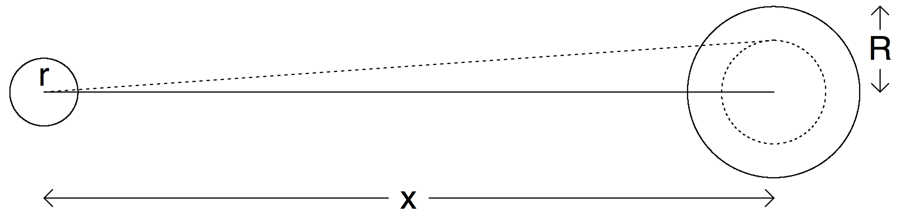

# 高尔夫 {#golf}


```{r}
library(tidyverse)
library(tidybayes)
library(rstan)
rstan_options(auto_write = TRUE)
options(mc.cores = parallel::detectCores())
```


## 加载数据
```{r}
golf <- read.table("./rawdata/golf.txt", header = TRUE, skip = 2) %>% 
        as_tibble()
golf
```


```{r}
golf %>%
  mutate(p = y / n) %>% # success rate for putts taken at distance x
  mutate(
    binomial_sd = sqrt(p * (1 - p) / n)
  ) %>%
  ggplot(aes(x = x, y = p)) +
  geom_point() +
  geom_errorbar(aes(ymin = p - binomial_sd, ymax = p + binomial_sd),
    width = 0.1
  ) +
  theme_classic() +
  labs(
    x = "Distance from hole (feet)",
    y = "Probability of success", 
    title = "Data on putts in pro golf"
  )
```


```{r, out.width = '100%', echo = FALSE"}

```


## Logistic regression 

$$
y_j\sim\mbox{binomial}(n_j, \mbox{logit}^{-1}(a + bx_j)),
\mbox{ for } j=1,\dots, J.
$$

```{r}
golf
```


```{r, warning=FALSE, message=FALSE}
stan_program <- '
data {
  int<lower=1> N;            
  int n_trials[N];               
  int n_success[N];  
  int<lower=1> K;  
  matrix[N, K] X;            
}
parameters {
  vector[K] b;             
}
transformed parameters {
  vector[N] mu;                   
  mu = X * b;
}
model {
  target += binomial_logit_lpmf(n_success|n_trials, mu);
}

'

stan_data <- golf %>%
  tidybayes::compose_data(
    N          = n_distinct(x),
    n_trials   = golf$n,  
    K          = 2,  
    n_success  = golf$y,
    X          = model.matrix(~ x, .)
  )

fit_logistic <- stan(model_code = stan_program, data = stan_data)
```


```{r}
fit_logistic %>% 
  rstan::extract(pars = c('mu'))
```


```{r}
fit_logistic %>% 
  tidybayes::spread_draws(mu[i]) %>% 
  mean_qi() %>% 
  mutate(mu = brms::inv_logit_scaled(mu))
```


```{r}
fit_logistic %>% 
  tidybayes::spread_draws(mu[i]) %>% 
  mean_qi() %>% 
  mutate(mu = brms::inv_logit_scaled(mu)) %>% 
  mutate(
    distance   = golf$x,  
    cases      = golf$n,  
    success    = golf$y,
    rate       = success/cases
  ) %>% 
  ggplot(aes(x = distance, y = rate)) +
  geom_point() +
  geom_line(aes(x = distance, y = mu))
```

```{r}
post_draw <- fit_logistic %>% 
  tidybayes::spread_draws(mu[i], n = 30) %>% 
  ungroup() %>% 
  mutate(mu = brms::inv_logit_scaled(mu)) %>% 
  group_by(.draw) %>% 
  mutate(distance = golf$x) %>% 
  ungroup()
post_draw
```


```{r}
post_draw %>% 
  ggplot() +
  geom_point(data= golf, aes(x = x, y = y/n)) +
  geom_line(aes(x = distance, y = mu, group = .draw), alpha = 0.2)
```


## Modeling from first principles 

Our model then has two parts:
$$
y_j \sim \mbox{binomial}(n_j, p_j)\\
p_j = 2\Phi(\sin^{-1}((R-r)/x) / \sigma) - 1 , \mbox{ for } j=1,\dots, J.
$$


Here is the model in Stan:


```{r, warning=FALSE, message=FALSE}
stan_program <- '
data {
  int N;            
  int n_trials[N];               
  int n_success[N];  
  vector[N] x;
  real r;
  real R;
}
parameters {
  real<lower=0> sigma;             
}
transformed parameters {
  vector[N] p;   
  for (i in 1:N) {
   p[i] = 2 * Phi( asin((R-r)/x[i])/ sigma) - 1;
  }
}
model {
  target += binomial_lpmf(n_success|n_trials, p);
}
generated quantities {
  real sigma_degrees;
  sigma_degrees = (180/pi())*sigma;
}
'

stan_data <- golf %>%
  tidybayes::compose_data(
    N          = n_distinct(x),
    n_trials   = golf$n,  
    n_success  = golf$y,
    x          = golf$x,
    r          = (1.68/2)/12,
    R          = (4.25/2)/12
  )

fit_trig <- stan(model_code = stan_program, data = stan_data)
```


```{r}
fit_trig
```

抽取其中的p[i]，即，每个位置上的概率

```{r}
draw_trig <- fit_trig %>% 
  tidybayes::spread_draws(p[i]) %>% 
  mean_qi() %>% 
  mutate(
    distance   = golf$x,  
    cases      = golf$n,  
    success    = golf$y,
    rate       = success/cases
  ) 
draw_trig

draw_trig %>% 
  ggplot(aes(x = distance, y = p)) +
  geom_line()
```


```{r}
fit_logistic %>% 
  tidybayes::spread_draws(mu[i]) %>% 
  mean_qi() %>% 
  mutate(mu = brms::inv_logit_scaled(mu)) %>% 
  mutate(
    distance   = golf$x,  
    cases      = golf$n,  
    success    = golf$y,
    rate       = success/cases
  ) %>% 
  ggplot(aes(x = distance, y = rate)) +
  geom_point() +
  geom_line(aes(x = distance, y = mu)) +
  
  geom_line(data = draw_trig, aes(x = distance, y = p))
```


